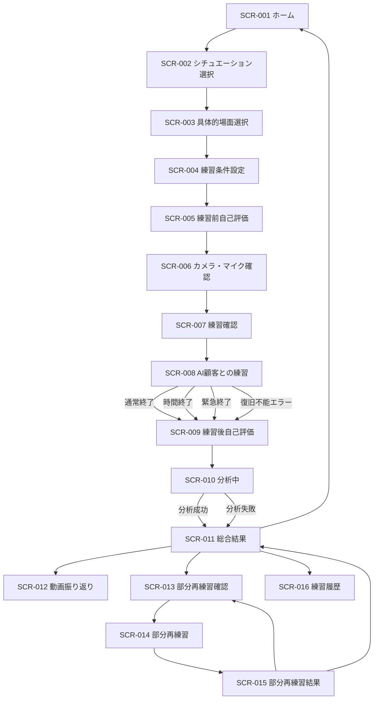
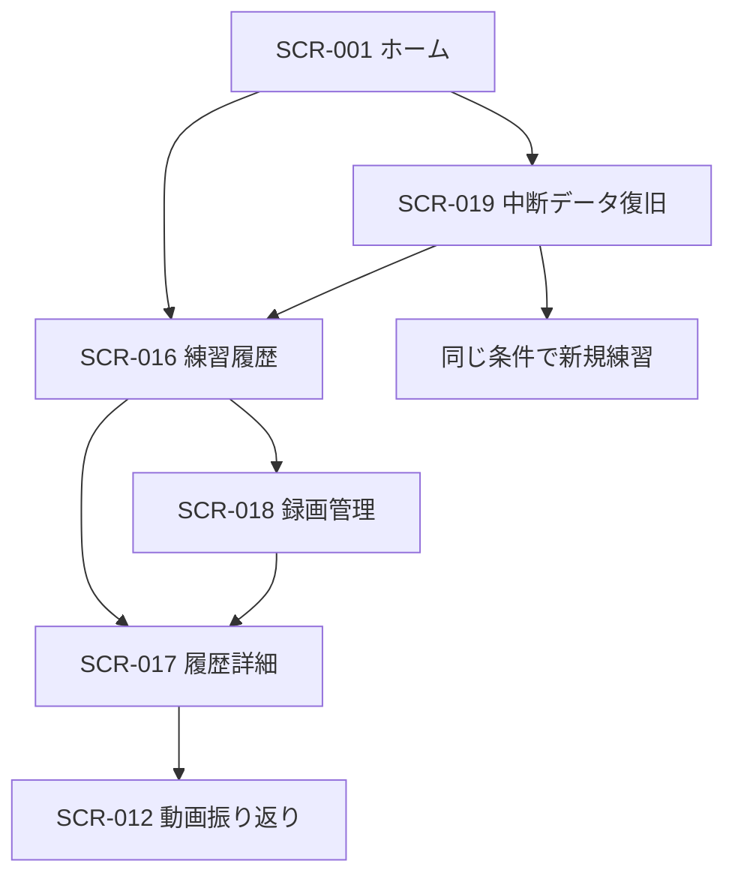
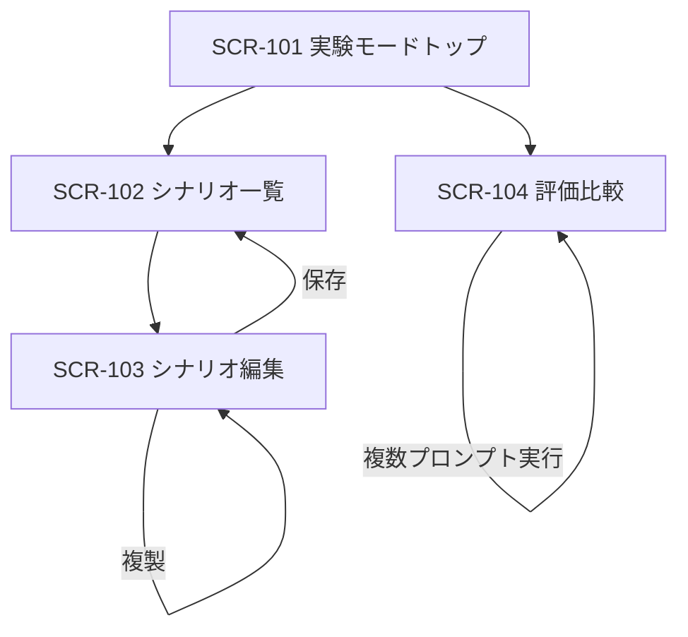

# 受託開発向けAI顧客折衝トレーニングアプリ

## 画面遷移図

# 4. 画面遷移図

## 4.1 通常練習フロー

```mermaid
flowchart TD
    A[SCR-001 ホーム] --> B[SCR-002 シチュエーション選択]
    B --> C[SCR-003 具体的場面選択]
    C --> D[SCR-004 練習条件設定]
    D --> E[SCR-005 練習前自己評価]
    E --> F[SCR-006 カメラ・マイク確認]
    F --> G[SCR-007 練習確認]
    G --> H[SCR-008 AI顧客との練習]

    H -->|通常終了| I[SCR-009 練習後自己評価]
    H -->|時間終了| I
    H -->|緊急終了| I
    H -->|復旧不能エラー| I

    I --> J[SCR-010 分析中]
    J -->|分析成功| K[SCR-011 総合結果]
    J -->|分析失敗| K

    K --> L[SCR-012 動画振り返り]
    K --> M[SCR-013 部分再練習確認]
    K --> N[SCR-016 練習履歴]
    K --> A

    M --> O[SCR-014 部分再練習]
    O --> P[SCR-015 部分再練習結果]
    P --> M
    P --> K
```

## 4.2 履歴・録画管理

```mermaid
flowchart TD
    A[SCR-001 ホーム] --> B[SCR-016 練習履歴]
    B --> C[SCR-017 履歴詳細]
    C --> D[SCR-012 動画振り返り]
    B --> E[SCR-018 録画管理]
    E --> C
    A --> F[SCR-019 中断データ復旧]
    F --> B
    F --> G[同じ条件で新規練習]
```

## 4.3 管理者実験モード

```mermaid
flowchart TD
    A[SCR-101 実験モードトップ] --> B[SCR-102 シナリオ一覧]
    B --> C[SCR-103 シナリオ編集]
    C -->|保存| B
    C -->|複製| C
    A --> D[SCR-104 評価比較]
    D -->|複数プロンプト実行| D
```

---
